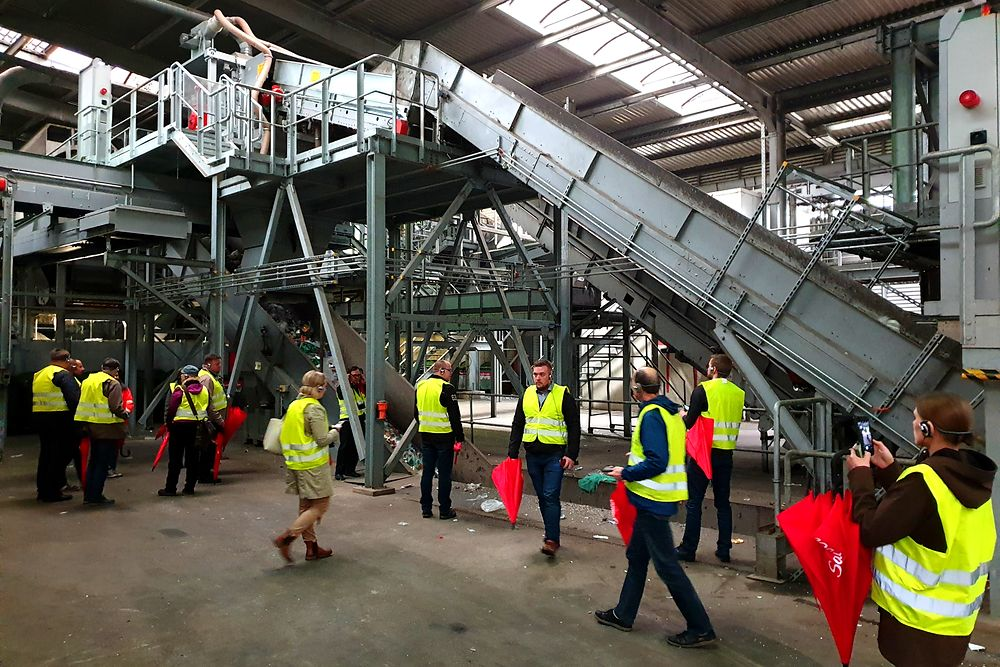

# FinDera Consulting — verkkosivut

Staattinen sivusto: pelkkää HTML:ää, CSS:ää ja JavaScriptiä. Ei build-vaihetta,
ei riippuvuuksia, ei asennuksia. Kansion sisältö on sellaisenaan valmis sivusto.

---

## Sisällys

- [Sivuston katselu omalla koneella](#sivuston-katselu-omalla-koneella)
- [Tiedostorakenne](#tiedostorakenne)
- [Tekstien muokkaaminen](#tekstien-muokkaaminen)
- [Kielet](#kielet-fi--en--de)
- [Kuvien vaihtaminen](#kuvien-vaihtaminen)
- [Yhteydenottolomake](#yhteydenottolomake)
- [Esikatselu asiakkaalle](#esikatselu-asiakkaalle-ennen-varsinaista-julkaisua)
- [Julkaisu ja findera.fi-osoitteen siirto](#julkaisu-ja-finderafi-osoitteen-siirto)
- [Laskeutumissivu](#laskeutumissivu-landing1html)
- [Tekniset ratkaisut](#tekniset-ratkaisut)

---

## Sivuston katselu omalla koneella

Avaa Terminaali, siirry tähän kansioon ja käynnistä paikallinen palvelin:

```bash
cd polku/projektikansioon
python3 -m http.server 8765
```

Avaa selaimessa <http://localhost:8765>.

> Käytä palvelinta äläkä avaa tiedostoja suoraan kaksoisklikkaamalla.
> Kielenvaihto lataa käännöstiedoston, mikä ei toimi `file://`-osoitteesta.

Palvelimen saa suljettua painamalla `Ctrl + C`.

---

## Tiedostorakenne

```
index.html            Etusivu
palvelut.html         Palvelut
projektit.html        Projektit ja referenssit
minusta.html          Martin Brandt
yhteystiedot.html     Yhteystiedot ja lomake
tietosuoja.html       Tietosuojaseloste (findera.fi/tietosuoja)
kiitos.html           Kiitossivu lomakkeen lähetyksen jälkeen
landing1.html         Kampanjan laskeutumissivu (findera.fi/landing1)
404.html              Virhesivu — Netlify tarjoilee tämän tuntemattomille osoitteille

assets/
  css/style.css       Kaikki tyylit (värit, typografia, animaatiot)
  css/fonts.css       Fonttimäärittelyt — älä muokkaa käsin
  js/main.js          Animaatiot, valikko, kielenvaihto, lomake
  i18n/en.json        Englanninkieliset tekstit
  i18n/de.json        Saksankieliset tekstit
  img/                Optimoidut kuvat (WebP + JPG-varmistus)
  img/findera-logo.svg  Logo erillisenä tiedostona (esim. sähköpostiallekirjoitus)
  img/favicon.svg     Selaimen välilehden kuvake
  img/apple-touch-icon.png  iOS-kotinäytön kuvake (renderöity favicon.svg:stä)
  fonts/              Itse isännöidyt fontit

assets/logos/
  mono/               Asiakaslogot yksivärisinä (etusivun nauha)
  vari/               Asiakaslogot omissa väreissään (Projektit-sivun kortit)

content/              Sivuston tekstit sivuittain ja kielittäin — ks. content/README.md
  index/              fi.json, en.json, de.json
  palvelut/           fi.json, en.json, de.json
  projektit/          fi.json, en.json, de.json
  minusta/            fi.json, en.json, de.json
  yhteystiedot/       fi.json, en.json, de.json

tools/
  build_images.py     Kuvaskripti (rajaus + sävyjen yhtenäistäminen)
  build_landing_images.py  Laskeutumissivun kuvat (lp-*.webp)
  build_logos.py      Asiakaslogojen käsittely (yksiväristys + koon tasaus)
  build_content.py    Kokoaa content/-kansion sivuston nykyisestä sisällöstä
  apply_content.py    Vie content/-kansion tekstit takaisin sivustolle

robots.txt            Hakukoneohjeet
sitemap.xml           Sivukartta hakukoneille
netlify.toml          Julkaisuasetukset
```

---

## Tekstien muokkaaminen

Tekstejä voi muokata kahdella tavalla. **Suositeltu tapa on `content/`-kansio**,
jossa kaikki tekstit ovat sivuittain ja kielittäin omissa tiedostoissaan
selkein nimin ja selittein:

```bash
# 1. muokkaa tiedostoja content/<sivu>/<kieli>.json
# 2. katso mitä muuttuisi
python3 tools/apply_content.py --kokeile
# 3. vie muutokset sivustolle
python3 tools/apply_content.py
```

Ohjeet ovat tiedostossa [content/README.md](content/README.md). Alla oleva
kuvaus HTML-tiedostojen suorasta muokkaamisesta pätee edelleen, jos haluat
tehdä nopean yksittäisen korjauksen.

**Suomenkieliset tekstit ovat suoraan HTML-tiedostoissa.** Avaa haluamasi sivu
tekstieditorissa (esim. VS Code), etsi teksti ja kirjoita päälle. Älä koske
merkintöihin kuten `data-i18n="hero.lead"` — ne kertovat, mistä käännös haetaan.

Esimerkki tiedostosta `index.html`:

```html
<p class="hero__lead" data-i18n="hero.lead">
  Yhdistän suomalaiset hankkeet ja organisaatiot oikeisiin kohteisiin…
</p>
```

Muokkaa vain tageja `>` ja `<` välissä olevaa tekstiä.

> **Muista:** jos muutat suomenkielistä tekstiä, päivitä vastaava kohta myös
> tiedostoihin `assets/i18n/en.json` ja `de.json` — sama avain, esim. `"hero.lead"`.

### Tunnusluvut

Etusivun luvut animoituvat laskurina. Luku on kahdessa paikassa:

```html
<span class="stat__num" data-count="70" data-suffix="+">70+</span>
```

Muuta molemmat: `data-count="70"` (animaation loppuarvo) ja näkyvä `70+`.

---

## Kielet: FI / EN / DE

Suomi on ensisijainen kieli ja se on kirjoitettu suoraan HTML:ään. Tämä tarkoittaa,
että suomenkielinen sivusto näkyy heti, toimii ilman JavaScriptiä ja indeksoituu
hakukoneisiin täysin.

Englanti ja saksa ladataan päälle vasta, kun kävijä valitsee kielen
yläpalkin `FI`-valikosta. Valinta muistetaan selaimessa.

Kieleen voi myös linkittää suoraan:

- `https://www.findera.fi/?lang=de`
- `https://www.findera.fi/palvelut.html?lang=en`

Käännöstiedostojen rakenne:

```json
{
  "common": { "nav.services": "Leistungen" },      // kaikilla sivuilla
  "pages": {
    "index.html":  { "hero.lead": "Ich verbinde…" }, // vain etusivulla
    "palvelut.html": { "ph.title": "…" }
  }
}
```

Sama avain voi tarkoittaa eri asiaa eri sivuilla (esim. `ph.title`), siksi
sivukohtaiset tekstit ovat `pages`-osiossa.

---

## Kuvien vaihtaminen

Kuvat ovat kansiossa `assets/img/` valmiiksi optimoituina useassa koossa
(esim. `palvelu-matkat-1000.webp` ja `palvelu-matkat.jpg`).

Kuvat tuotetaan skriptillä `tools/build_images.py`. Se lukee alkuperäiset
kuvat kahdesta kansiosta — `Findera kuvat/good pictures` ja referenssikorttien
omat kuvat kansiosta `Documents/FinDera/Referenssikuvat` — kääntää ne oikein
päin, rajaa kiinteisiin kuvasuhteisiin, yhtenäistää valotuksen ja värit ja
pakkaa verkkokäyttöön. Ajo (vaatii Pythonin ja Pillow-kirjaston):

```bash
python3 tools/build_images.py
```

Skriptin kohdassa `MANIFEST` jokaisella kuvalla on rivi muotoa

```python
"case-lsjh": ("20250307_104431.jpg", "card", AR_CARD, 0.85),
```

Viimeinen luku on **rajauksen painopiste pystysuunnassa**: 0 = rajaa kuvan
yläreunasta, 1 = alareunasta. Mitä suurempi luku, sitä alempaa kuvasta
rajataan — käytä isoa arvoa, kun ihmiset ovat kuvan alalaidassa.
Kuvan vaihtaminen onnistuu vaihtamalla tiedostonimi samalle riville: skripti
etsii tiedoston molemmista lähdekansioista.

> Muista päivittää myös kuvan `alt`-teksti `projektit.html`-tiedostossa, kun
> vaihdat referenssikortin kuvan.

### Asiakaslogot

Referenssiyritysten logot ovat kansiossa `assets/logos/`. Ne tuotetaan skriptillä

```bash
python3 tools/build_logos.py
```

Skripti lukee alkuperäiset logot kansiosta `Documents/FinDera/Referenssit`, poistaa
valkoisen taustan, tekee etusivun nauhaa varten yksivärisen version FinDeran
tummanvihreällä ja tasaa kaikkien logojen optisen koon niin, että rivi näyttää
tasapainoiselta. Tiedostot tehdään kaksinkertaisella tarkkuudella, jotta ne ovat
teräviä myös tarkoilla näytöillä.

Uuden asiakaslogon lisääminen: kopioi tiedosto `Referenssit`-kansioon, lisää rivi
skriptin `LOGOS`-listaan, aja skripti ja lisää `<span class="marquee__item">`
etusivun nauhaan (ja tarvittaessa `` referenssikorttiin).

Muista aina päivittää myös kuvan `alt`-teksti HTML:ssä — se kertoo
näkövammaisille ja hakukoneille, mitä kuvassa on:

```html

```

---

## Yhteydenottolomake

Lomake on tiedostossa `yhteystiedot.html` ja se käyttää **Netlify Formsia**.
Viestit tallentuvat Netlifyn hallintapaneeliin ja lähtevät sähköpostilla
osoitteeseen **martin.brandt@findera.fi**.

Sivuston koodissa kaikki on jo valmiina:

* lomakkeen nimi on `yhteydenotto`
* mukana on pakollinen piilokenttä `<input type="hidden" name="form-name" value="yhteydenotto">`
* roskapostisuoja on piilokenttä `bot-field` (`netlify-honeypot="bot-field"`)
* onnistuneen lähetyksen jälkeen kävijä ohjataan sivulle `kiitos.html`

### Kertaluonteinen käyttöönotto Netlifyssä

Nämä kaksi asetusta täytyy tehdä kerran Netlifyn hallinnasta — niitä ei voi
laittaa tiedostoihin.

1. **Kytke lomakkeiden tunnistus päälle.**
   Netlifyssä: valitse sivusto → **Project configuration** (vanhemmissa
   *Site configuration*) → **Forms** → **Enable form detection**.
   Tämän jälkeen **julkaise sivusto uudelleen** (raahaa kansio Deploys-välilehdelle),
   sillä Netlify tunnistaa lomakkeen vasta julkaisun yhteydessä.

2. **Lisää sähköposti-ilmoitus.**
   **Forms** → **Form notifications** → **Add notification** → **Email notification**
   → *Email to notify*: `martin.brandt@findera.fi`. Valitse lomakkeeksi `yhteydenotto`.

Tarkista lopuksi: täytä lomake sivustolla ja lähetä. Viestin pitää ilmestyä
Netlifyn **Forms**-välilehdelle ja sähköpostiin. Jos viestiä ei tule, katso
ensin roskapostikansio.

> Netlifyn maksuttomassa versiossa lomake ottaa vastaan 100 viestiä kuukaudessa.
> Se riittää hyvin — jos raja tulee vastaan, Netlify ilmoittaa siitä.

### Jos lomakepalvelu vaihdetaan joskus toiseen

Selain lähettää lomakkeen JavaScriptillä, ja `assets/js/main.js` tunnistaa
Netlify-tilan `data-netlify`-attribuutista. Jos `data-netlify="true"` poistetaan
ja tilalle laitetaan esimerkiksi `action="https://formspree.io/f/abcdwxyz"`,
sama koodi lähettää lomakkeen sinne ilman muita muutoksia.

---

## Esikatselu asiakkaalle

> **Sivusto on julkaistu.** `findera.fi` osoittaa jo tähän sivustoon, joten alla
> olevaa esikatselutapaa tarvitaan vain, jos haluat näyttää jonkin ison muutoksen
> erikseen ennen kuin se menee tuotantoon. Tavalliset päivitykset menevät suoraan
> tuotantoon, kun muutos työnnetään GitHubiin.
>
> **Älä tee esikatselusta uutta Netlify-sivustoa saman sisällön kanssa.** Se olisi
> hakukoneelle koko sivuston kaksoiskappale. Nykyinen `findera-esikatselu.netlify.app`
> on sama Netlify-sivusto kuin tuotanto, ja se ohjautuu `netlify.toml`-tiedoston
> asetuksella pysyvästi osoitteeseen `www.findera.fi`.

Jos haluat silti näyttää version erikseen kommentoitavaksi:

1. Kirjaudu <https://app.netlify.com/drop> (ilmainen tili, esim. Google-tunnuksilla)
2. Raahaa **koko tämä kansio** selainikkunaan
3. Noin 30 sekunnin kuluttua saat osoitteen muodossa `sattumanvarainen-nimi.netlify.app`
4. Lähetä osoite Martinille — se toimii tietokoneella ja puhelimella

Sivuston nimen voi vaihtaa selkeämmäksi: **Site configuration → Change site name**
(esim. `findera-esikatselu.netlify.app`).

> **Linkki on julkinen mutta listaamaton.** Kuka tahansa, jolla on osoite, näkee
> sivuston. Salasanasuojaus on Netlifyn maksullinen ominaisuus. Esikatseluun tämä
> riittää yleensä hyvin, koska osoitetta ei jaeta muualle eikä hakukone löydä sitä.

### Päivitetyn version vieminen samaan osoitteeseen

Kun sivustoon on tehty muutoksia ja haluat päivittää **saman linkin** (osoite ei
muutu, joten aiemmin lähetetty linkki toimii edelleen):

1. Kirjaudu <https://app.netlify.com>
2. Valitse listasta oikea sivusto
3. Avaa välilehti **Deploys**
4. Vieritä sivun alalaitaan, jossa lukee
   *"Need to update your site? Drag and drop your site output folder here"*
5. Raahaa **koko kansio** `Visual Studio - FD` siihen alueeseen
6. Odota noin 30 sekuntia — uusi versio näkyy listassa merkinnällä **Published**

Vanhat versiot säilyvät listassa, joten voit tarvittaessa palata edelliseen
painamalla vanhan version kohdalta **Publish deploy**.

> **Jos sivusto katosi listasta:** Netlify Dropilla tehty sivusto häviää, jos sitä
> ei ole liitetty tiliin. Tee tällöin uusi julkaisu osoitteessa
> <https://app.netlify.com/drop> ja paina heti perään **Claim site**, niin sivusto
> tallentuu tiliisi ja päivittäminen onnistuu jatkossa yllä olevalla tavalla.

### Jos selain näyttää vanhaa sisältöä

Tiedosto `netlify.toml` on asetettu niin, että selain tarkistaa sivut, kuvat,
tyylit ja skriptit palvelimelta joka käynnillä. Siirtoa tapahtuu vain, jos
tiedosto on oikeasti muuttunut, joten sivusto pysyy nopeana mutta myös ajan
tasalla. Käytännössä pelkkä sivun lataaminen uudelleen riittää.

Jos vanha versio jää silti näkyviin:

| Laite | Toimi näin |
|---|---|
| Mac | `Cmd + Shift + R` |
| Windows | `Ctrl + F5` tai `Ctrl + Shift + R` |
| iPhone / iPad | Avaa linkki yksityisessä välilehdessä |
| Android | Avaa linkki incognito-välilehdessä |

**Varmin tapa kaikille laitteille** on lisätä osoitteen perään versionumero,
esimerkiksi `https://sivustosi.netlify.app/?v=2`. Selain pitää sitä uutena
osoitteena ja hakee kaiken tuoreena. Numeroa voi kasvattaa jokaisella
päivityksellä. Tämä toimii myös puhelimessa, jossa ei ole
näppäinyhdistelmää kovalle päivitykselle.

> Kielilinkin kanssa yhdistettynä: `https://sivustosi.netlify.app/?v=2&lang=de`

## Julkaisu ja findera.fi-osoitteen siirto

Suositus: **Netlify** — maksuton, nopea ja hoitaa HTTPS-varmenteen automaattisesti.

### 1. Vie sivusto verkkoon

Helpoin tapa ilman komentorivityökaluja:

1. Kirjaudu <https://app.netlify.com>
2. Valitse **Add new site → Deploy manually**
3. Raahaa **tämä kansio** selainikkunaan
4. Sivusto on heti käytettävissä osoitteessa `satunnainen-nimi.netlify.app`

Tarkista tässä vaiheessa, että kaikki toimii: valikot, kielenvaihto ja lomake.

### 2. Siirrä findera.fi uudelle sivustolle

1. Netlifyssä: **Domain settings → Add a domain** → `findera.fi`
2. Netlify näyttää tarvittavat DNS-tietueet.
3. Kirjaudu verkkotunnuksen rekisteröijän palveluun (sinne, mistä findera.fi on
   hankittu) ja päivitä tietueet:
   - `www` → CNAME → `nimesi.netlify.app`
   - juuriosoite `findera.fi` → Netlifyn antama A-tietue tai ALIAS
4. Poista vanhat Google Sites -tietueet.
5. Odota, että muutos leviää (yleensä 15 min – 24 h).
6. Kytke lopuksi **HTTPS** päälle Netlifyn Domain settings -osiosta.

> **Vinkki:** älä pura Google Sites -sivustoa ennen kuin uusi sivusto toimii
> findera.fi-osoitteessa. Näin vanha sivusto on tallessa varmuuden vuoksi.

### 3. Julkaisun jälkeen

- Ilmoita uusi sivukartta Google Search Consolessa: `https://www.findera.fi/sitemap.xml`
- Tarkista, että `netlify.toml`-tiedoston uudelleenohjaus `/ota-yhteytta`
  vie oikeaan paikkaan (vanha Google Sites -osoite).

### Päivitysten julkaisu myöhemmin

Muokkaa tiedostoja, raahaa kansio uudelleen Netlifyn **Deploys**-välilehdelle.
Jos haluat automaattisen julkaisun, vie kansio GitHubiin ja kytke se Netlifyyn —
tällöin jokainen tallennettu muutos päivittyy verkkoon itsestään.

---

## Laskeutumissivu (landing1.html)

`landing1.html` on erillinen kampanjasivu osoitteessa **findera.fi/landing1**.
Se poikkeaa muista sivuista kolmella tavalla:

1. **Tekstit ovat suoraan HTML-tiedostossa**, eivät `content/`-kansiossa.
   Sivu on vain suomeksi, joten `apply_content.py` ei koske siihen.
   Merkintä `<html lang="fi" data-no-i18n>` kertoo `main.js`:lle, ettei
   kielenvaihtoa saa soveltaa tähän sivuun.
2. **Ei valikkoa eikä alatunnisteen linkkiverkkoa.** Laskeutumissivun idea on,
   että lukija etenee CTA-painikkeiden kautta eikä eksy muualle. Painikkeet
   vievät sivuston varsinaisille sivuille (`minusta.html`, `projektit.html`,
   `palvelut.html#matkat`, `yhteystiedot.html`).
3. **`noindex`-tagi.** Sivu ei näy Googlessa eikä ole sivukartassa, jottei se
   kilpaile etusivun kanssa samoista hakusanoista.

Ulkoasu käyttää samaa `assets/css/style.css`-tiedostoa kuin muu sivusto, joten
värit ja typografia pysyvät yhtenäisinä. Sivun omat asettelusäännöt ovat
`<style>`-lohkossa tiedoston alussa, ja ne on nimetty `lp-`-etuliitteellä.

**Kuvat.** Sivun omat kuvat tuotetaan kansiosta `Documents/FinDera/Landing Pages`:

```bash
python3 tools/build_landing_images.py
```

Skripti irrottaa kuvakollaasista ruudut kiinteillä pikselirajoilla ja tallentaa
ne nimillä `lp-*.webp` (+ jpg-varmistus). Referenssikorttien kuvat ovat sivuston
omia `case-*`-kuvia. Jos kollaasin ruutujen paikat muuttuvat, päivitä `RUUDUT`-
sanakirja skriptin alussa.

> **Muista:** referenssikorttien tekstit on kopioitu `projektit.html`-sivulta.
> Jos muutat caseja siellä, päivitä myös laskeutumissivu.

## Tekniset ratkaisut

**Fontit isännöidään itse.** `Newsreader` (otsikot) ja `Inter` (leipäteksti) on
ladattu kansioon `assets/fonts/`. Sivusto ei siis tee yhtään pyyntöä Googlen
palvelimille — tämä on tietoinen valinta GDPR:n vuoksi, koska asiakaskuntaa on
Saksassa, missä Google Fontsin suora käyttö on todettu ongelmalliseksi.

**Ei evästeitä eikä seurantaa.** Sivusto ei aseta evästeitä, joten evästebanneria
ei tarvita. Kielivalinta tallennetaan selaimen omaan muistiin (localStorage),
mikä ei ole eväste eikä vaadi suostumusta.

**Tietosuojaseloste** on omalla sivullaan `tietosuoja.html` kolmella kielellä ja
kuuluu `content/`-käännösputkeen kuten muutkin sivut. Linkki on jokaisen sivun
alatunnisteessa. Selosteen luku 6 kertoo, ettei sivustolla ole analytiikkaa —
**jos kävijämittaus joskus otetaan käyttöön, tämä luku on päivitettävä samalla.**

**Saavutettavuus.** Sivusto kunnioittaa käyttöjärjestelmän *vähennä liikettä*
-asetusta: jos se on päällä, kaikki animaatiot poistuvat käytöstä. Sivustoa voi
käyttää näppäimistöllä, ja jokaisella sivulla on "Siirry sisältöön" -linkki.

**Toimii ilman JavaScriptiä.** Jos JavaScript estetään, koko sisältö näkyy silti
normaalisti — vain animaatiot ja kielenvaihto jäävät pois.

**Kuvat.** Tarjoillaan WebP-muodossa useassa koossa, JPG varmistuksena.
Selain lataa kuvat vasta kun ne tulevat näkyviin.
